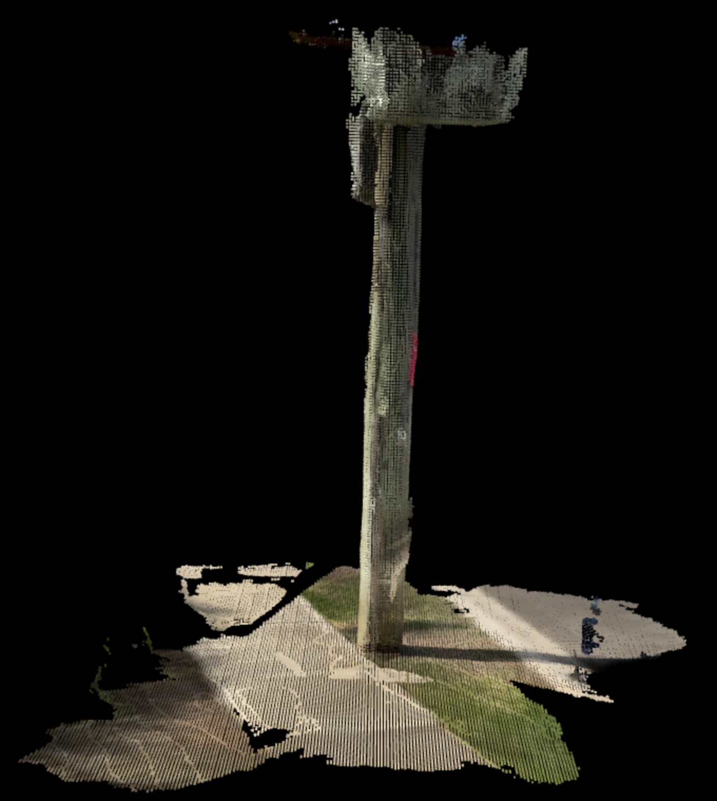
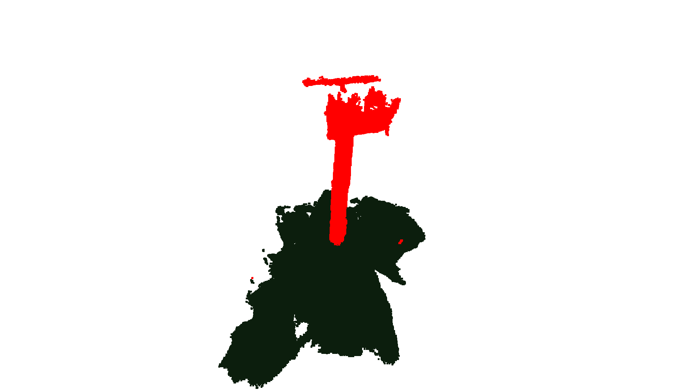

## Point cloud segmentation exercise

Neara recently launched a [new product](https://www.neara.com/revolutionary-automated-lidar-classification/) for automatic LiDAR classification. We have to deal with a lot of LiDAR point cloud files -- often in the hundreds of millions to billions of points.

This exercise provides a bit of exposure to point cloud processing and segmentation. We captured a bit of LiDAR on an iPad Pro ([./data/Pole1.las](./Pole.las)). When visualized, it looks like this:




The main notebook to use is [./main.ipynb](./main.ipynb).

## Quick Start
You can use either the pipfile or the generated requirements.txt.
```bash
# Python 3.9+
pipenv install
pipenv run jupyter notebook
```

## Requirements & constraints
Your task is to do a little bit of segmentation to detect the ground and colour it green.

- document your approach. What heuristics did you use? What / how the algorithm works, their tradeoffs and how you could improve it if you spent more time on it.
- you can use libraries of your choosing for helper functions and classes but you cannot use functions that would implement the bulk of the algorithm i.e. you can use `sklearn.linear_model.LinearRegression` but you can't use something like `library.detect_ground()`
- output the final colouring using the provided visualize() function or you can plot the images with something like matplotlib. If you do it file based, it could be `ground[0-5].png` in the current directory

Bonus points if you can derive extra segments of the pole or the surroundings. There is a reference link at the bottom to some datasets if you want to take an ML approach.

## Inputs
Scans are available in the [./data](./data/) folder. You can assume the biggest and main vertical stick is the power pole.

For convenience, the axis has been drawn as well when you use the `visualize()` function.

X = red, Y = green, Z = blue


## Example output
```python
# pcd is the original point cloud
ground_points = pcd.select_by_index([0,1,2,3,4])
# dark green
ground_points.paint_uniform_color([0.047,0.117,0.050])       

visualize([pcd, ground_points, pole_parts], capture_filename='ground1.png')
```


For brevity some code was removed but you will also notice that the solution detected the crossarm and the pole separately as well.

## Sample solution
There's a sample solution at [naive_solution.ipynb](./naive_solution.ipynb) which demonstrates some basics of wrangling the las files and uses a hardcoded metric on one axis.



## References

http://lidarview.com/

http://www.open3d.org/docs/release/

https://paperswithcode.com/datasets?mod=point-cloud
